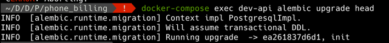

# Phone Billing Service

## Summary

A very simple phone billing system as a microservice using Python
with major package dependencies like FastAPI, SQLModel (sqlalchemy, pydantic), alembic.

The service uses PostgreSQL in dev Docker container, and SQLite when running tests.

Service comes with a `test` container as well where all the linters, unit and integrations tests are run.

Use cases:
* As a phone operator I want all customer calls to be charged.
* As a customer I want to be able to see my phone call history.
* As a customer I want to receive my invoice every first day of the month.

This is just a RESTful API implementation that solves the use cases mentioned above (no UI to it).

The API comes with OpenAPI documentation that can be browsed under `/docs` path of the API,
so when running locally with help of provided docker-compose.yml setup, you can visit http://localhost:8080/docs

## Installation

In order to start the application you need to have Docker installed.

First, you need to build docker images with help of docker-compose
(all the docker commands need to be called from the repository root directory):

```shell
docker-compose build
```

Next, we need to execute Alembic migrations to create initial DB structure:

```shell
docker-compose exec dev-api alembic upgrade head
```

You should then see an output similar to this, meaning that "init" migration has ran
and initialized all the tables. 



You should now be able to start the service:

```shell
docker-compose up dev-api
```

And visit the OpenAPI spec to learn more about the API: http://localhost:8080/docs

## Testing

The application comes equipped with a test docker container to run the test suite
(comprised of unit and integration tests) and other linters and static code analyzers.

```shell
docker-compose run --rm test
```
